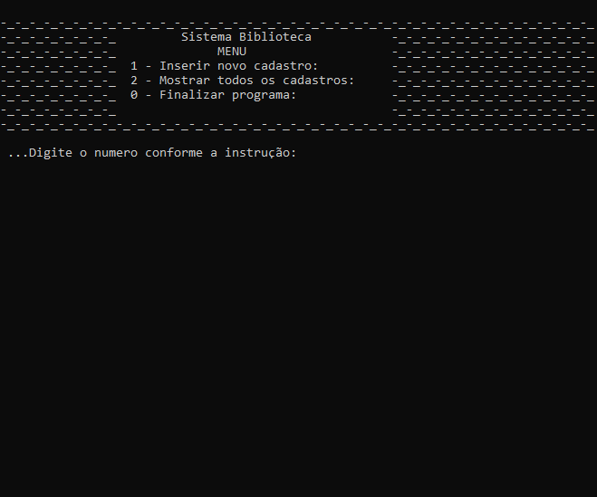

# library

### Simple project developed in C to discipline of Algorithms and programming logic II 📚 

#### Consider that you are a freelance desktop systems developer. To start your portfolio, you decide to test a system idea for libraries. Thus, you decide that you will create a Proof of Concept program to validate your ideas and also to be able to show your potential customers. Thus, your program, in beta version (trial version), should allow you to store the registration of a maximum of 5 (five) books at a time (per program execution).
 
#### For each book, the application must store the following information:
* A unique code, automatically generated by the system;
* The name of the authors of the work;
* The name of the work;
* The name of the publisher.

#### 1 - Insert a new registration: when selecting this option, the user must be able to inform all the data of a book. Namely: your name, the authors, and the name of the publisher; the registration code must not be informed by the user as the program must automatically generate it. If the program has already stored the maximum number of books (five), an error message should be displayed: “Registration system full. It is not possible to store more information! ”. The registration code must be filled in automatically by the system and the user must not have the option to change this code. It is important to point out that for each register, it must have a different code, that is, it must not be possible that there are two registers with the same code at the same time;
 
#### 2 - Show all entries: when selecting this option, the program should print, on the screen, for each book, its code, its name, the authors and the publisher. This option should show on the screen only the data from books that have been registered. If any other spare information is printed, or if previously registered information is missing, it will be considered a programming error. If no customer has been registered, before attempting to execute this option (2 - Show all entries), the program should display the message "List empty!";
 
#### 0 - Terminate: the program must be terminated if, and only if, the user chooses this option.

#### Important notes:
#### Whenever the user wants to execute options 1 or 2 (except 0), the program must perform what is requested in the statement and, right after that, the program must return to the menu, giving the user the possibility to execute any of the options again listed in the menu.
#### The program should present a menu of options to the user:
#### If the user chooses an option that is not on the menu, the program should display an error message, for example, "Error: invalid option!"; returning to the menu shortly thereafter. Otherwise, the program should not print this error message, that is, if the user tries to execute options 0, 1 or 2, the program does not enter an error state.
